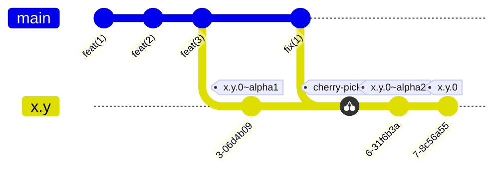
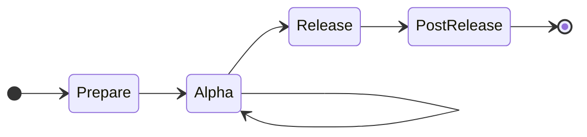
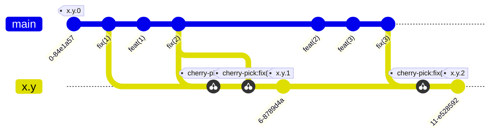
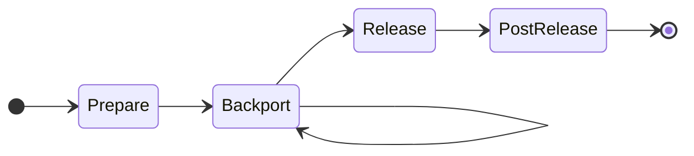

# Release Process

## TODO

- [x] Move the current release process docs into dev docs
- Followup with PR that proposes improvements to release
    - We need CI to catch obvious packaging mistakes:
    - [ ] Fix changelog header (we don't need it, just a comment): https://github.com/ocaml/dune/pull/13873
    - Document improved diffing: first rerun on last release, then cut a new one
    - Diff based on html
    - Optimistic instead of pessimistict
    - Release from tag on trunk?

### Goal

- We don't need a release manager
   - Just a button to push or script to run
- push-button release up to opam-repo publishing
  - e.g., run a git hub action which executes full release
  - human input needed is deciding which kind of release it is
- Ideally push revdeps "left" in the SDLC
- Sudha:
  - Where would we need manual interventino?
  - if revdeps fail

--- 

This document explains how we release dune. Its goal is to describe how things
are done in practice, not discuss how they should be done. There are two
aspects to this:

- a fairly rigid flowchart-style process for each type of release
- a softer "decision" section that explains what should inform the decisions to
  take when there is a manual call to make.

## Prerequisites

- dune-release installed in your local switch

## Major / Minor Releases (`x.y.0`)





- Prepare:
  - Open tracking issue with expected branching date
  - List (and update) known blockers. These prevent releasing `x.y.0`
  - Add "All x.y.z changelogs merged" as blocker
  - Add "Mirage test" as blocker (manual workflow should be triggered on a
    alpha release)
  - Review changelog to ensure
    - PR/issue numbers are correct
    - The changes make sense

- Alpha time:
  - Branch setup:
    - create `x.y.0-rc` branch
    - Run `doc/changes/scripts/build_changelog.sh x.y.0~alpha0`
    - Review changelog for correct issues IDs and general intelligibility.
    - Prepare alpha release `0`
  - Prepare alpha release `N`:
    - Commit changelog update to release branch with commit messeag `[x.y] prepare x.y.z~alphaN release`
    - `make opam-release`
    - edit the release to mark it with `Set as a pre-release `
      - https://docs.github.com/en/rest/releases/releases?apiVersion=2026-03-10#update-a-release
    - mark opam-repo PR as draft
  - Wait for `opam-repo-ci`
  - Triage phase:
    - consider new failures comparing from latest "known good" release
    - ignore transient errors (disk full, switch disconnected, cancelled, etc)
    - file issues about regressions, add them to known blockers
    - compare the new CI revdeps errors with the errors from [previous releases](https://github.com/ocaml/dune/wiki/Reverse-dependencies-CI-logs).
      - To sort errors by release reason run (TODO)
  - If revdeps pass
    - then: 
      - go to release 
    - else: 
      - fix regression in `main`
      - cherry-pick fix commits from `main` to `x.y.-rc` branch
      - Prepare alpha release `N + 1` 
  - Mark opam alpha PR as closed

- Release time:
  - check versioned behaviors are relative to x.y
  - On release branch, prepare changelog (set header with version) `x.y.z (<date>)`
  - validate that there are no dangling changes in `doc/changes/{added,changed,fixed}`
  - commit onto `x.y.z-rc` brach with message `[x.y] release`
  - push to RC branch
  - `make opam-release` from updated release branch
  - ask opam repo maintainers to bypass the  opam-repo-ci 
  - In case of regression:
    - mitigate (for example if this happens on a single OS, set `available`
      appropriately)
    - prepare point release
    - in the worst case, the release can be cancelled completely and only come
      in a point release.

- Post-release:
  - Categorize changelog entries into Added / Fixed / Changed / Removed / Deprecated
  - Open PR on `ocaml/ocaml.org` to add a file in under `data/changelog/dune`
  - Post to discuss
  - Merge changelog
  - Increase the version of Dune to the new latest in the [GitHub CI](https://github.com/ocaml/dune/blob/9a274be98cb9c2786dd76184c19c44b89e061ea8/.github/workflows/workflow.yml#L350), [dune-project](https://github.com/ocaml/dune/blob/main/dune-project#L1) and in the [dune-rpc](https://github.com/ocaml/dune/blob/main/otherlibs/dune-rpc/private/types.ml#L30). E.g, if you released `X.Y.Z`, the new version become `X.(Y+1).Z`.
  - Add the copy of the revdeps file to the [previous releases](https://github.com/ocaml/dune/wiki/Reverse-dependencies-CI-logs) page
  - Close tracking issue

## Point Releases / Patch Releases (`x.y.z`, `z >= 0`)




- Pre-requisite:
  - Previous minor/major release is merged
    - changelogs of previous point releases are merged

- Prepare:
  - Create release tracking issue
  - List fixes present in main to backport
  - Blockers for this release include:
    - fixes for all reported regressions
    - all backports of listed fixes

- Backport:
  - Branch setup
    - Checkout the tag for the latest point release `x.y.z`
    - Create a new branch `x.y.z'` where `z' = z + 1`
  - `git cherry-pick` commits as merged in `main`
  - Open PR
    - Base: `x.y.z'-rc`
    - Set `x.y.z'-rc` as target branch, e.g. `gh pr create -B x.y.z'-rc`
    - Title must be `[x.y.z'] backport #<PR id>`
    - List PR in blockers

- Release:
  - Checkout `x.y.z'-rc`
  - Run `doc/changes/scripts/build_changelog.sh x.y.z'~alpha0`
  - `make opam-release`
  - Triage revdep failures

- Post-release:
  - Run `./announce.sh`
  - Post changelog on Discuss in the same thread as `x.y.0`
  - Merge changelog
  - Update the Dune target in the [nix-ocaml/nix-overlays](https://github.com/nix-ocaml/nix-overlays) (the hash is computed using `nix-prefetch-url --type sha256 <URL>`)
  - Close release tracking issue

## Decisions

- Release cadence:
  - we aim for a minor release roughly every 4 to 6 weeks. More than 8 tends to
    make riskier releases; less than 3 would be too much overhead.
  - we do point releases only for the latest release minor version.

- Release Go/No Go after alpha:
  - the goal is to determine, once the known blockers are fixed, if we need an
    alpha(N+1) to get enough confidence about `x.y.0`
  - downside if release is Go but a bug is found: need a quick point release.
  - downside if release is No Go but not bug is found: waste of ~1 day and
    the ~50k builds.

- Determine if a change can be backported:
  - it needs to be a fix, with no version-specific behaviour
  - it needs to be merged in `main`

- Triage:
  - The thing to determine is whether a failure is a regression: considering a
    failure, would the same build plan succeed with the previous release of Dune?
    - Ultimately it's possible to run that locally, for example with `opam
      build`.
    - Comparing to the previous release is often enough; but note that some new
      packages have been added in the meantime.
  - Transient errors can be ignored or restarted; however some of them like
    "solver timed out" can not succeed. Some packages are known to fail in
    `opam-repo-ci` but there is no good way to skip them.
  - Sending metadata fixes in `opam-repository` (e.g. OCaml 5 failures) is nice
    to do but not required.


## Announcement Template

```markdown
---
title: [ANN] Dune $VERSION
---

The Dune team is pleased to announce [the release of dune $VERSION](https://github.com/ocaml/dune/releases/tag/$VERSION).

$SUMMARY

If you encounter a problem with this release, you can report it on the ocaml/dune repository.

# Changelog

$CHANGELOG
```

---
title: [ANN] Dune 3.21.0
---

The Dune team is pleased to announce [the release of dune
 3.21.0](https://github.com/ocaml/dune/releases/tag/3.21.0).

This is a large release, including dozens of fixes and improvements, thanks to
many contributors.

See [the full changelog](https://github.com/ocaml/dune/releases/tag/3.21.0) for
all changes and contributors.

If you encounter a problem with this release, please report it in [our issues
tracker](https://github.com/ocaml/dune/issues).

---

We also note that @maiste has stepped from the role of release manager: on
behalf of the Dune team, I extend @maiste our thanks for his time caring out
this important service! :pray:
