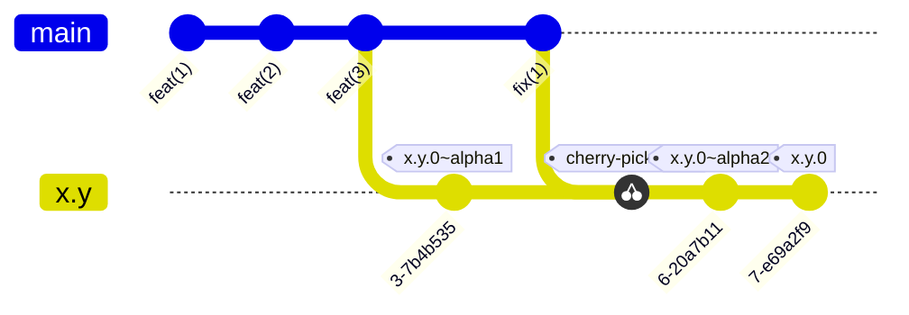
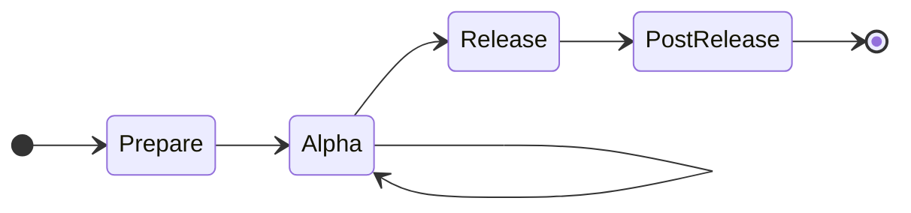
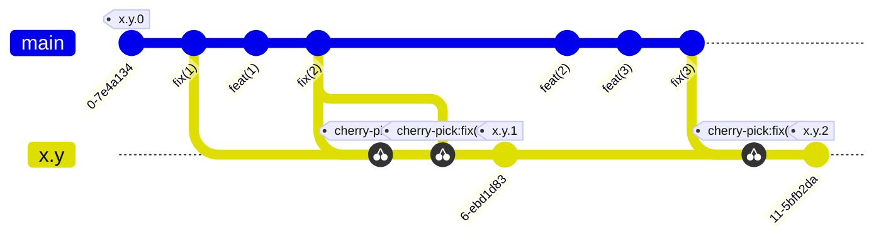
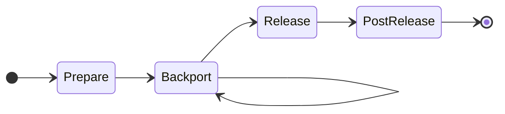

# Release Process

<!-- NB. This document used to be located on the github wiki, at
 https://github.com/ocaml/dune/wiki/Release-process -->

This document explains how we release dune. Its goal is to describe how things
are done in practice, not discuss how they should be done. There are two
aspects to this:

- a fairly rigid flowchart-style process for each type of release
- a softer "decision" section that explains what should inform the decisions to
  take when there is a manual call to make.

## Prerequisites

- The latest [dune-release](https://github.com/tarides/dune-release) installed in your dev switch
- A recent version of [github-cli](https://github.com/cli/cli) installed on your system

## Prepare

Open a [release tracking issue][release-issue] and work thru its checklist,
including listing and updating known blockers that are preventing release

[release-issue]: https://github.com/ocaml/dune/issues/new?template=release.md

## Major / Minor Releases (`x.y.0`)

### Pre-release phase

During the pre-release phase, we produce alpha releases, which we use to run the
opam-ci to check for integration with the wider ocaml ecosystem.

1. Create and checkout the release candidate branch `X.Y.Z-rc` from the head of
   `main`
2. Let `N=0`
3. Prepare alpha release
    - If `N>0`
        - Get all regressions fixed in `main`
        - Either cherry-pick the fixes from `main` into the rc branch, or create a
          new branch off `main`. (This is a judgment call, based on weighing risk of
          picking up new regressions vs. the benefits of simpler process and picking
          up additional improvements from main.)
        - Run pre-release CI jobs on `X.Y.Z-rc` branch
            - [mirage](https://github.com/ocaml/dune/actions/workflows/mirage.yml)
            - [packaging](https://github.com/ocaml/dune/actions/workflows/isolated-package-build.yml)
        - If the pre-release CI detects regreessions, goto (3).
    - Build the changelog via `doc/changes/scripts/build_changelog.sh x.y.0~alphaN`
    - Review the resulting changelog for intelligibility.
    - Commit the changelog update to the release branch with the commit message `[X.Y.Z] prepare alphaN release`
    - Run `make opam-release`
        - [edit the release][edit-release] to mark it with `Set as a pre-release`
        - mark resulting opam-repo PR as a draft
    - Wait for the `opam-ci` results
    - Review the results:
        - Any build or test failures in dune's own packages require fixes
        - compare the new CI revdeps errors with the [errors from previous
          releases][prev-releases].
            - ignore transient errors (disk full, switch disconnected, cancelled, etc)
        - If defects are discovered:
            - File issues about all regressions, add them to known blockers
            - Mark opam alpha PR as closed
            - Let `N=N+1` and goto (3)

[edit-release]: https://docs.github.com/en/rest/releases/releases?apiVersion=2026-03-10#update-a-release
[prev-releases]: https://github.com/ocaml/dune/wiki/Reverse-dependencies-CI-logs

### Release phase

- On release branch, prepare changelog
    - combine all entries from different alpha release
    - set the version header to `X.Y.Z (<date>)`
- commit onto `X.Y.Z-rc` branch with message `[X.Y.Z] release` and push to remote
- Push release branch to remote
- Run `make opam-release` from updated `X.Y.Z-rc` branch
- Add a comment on the opam repo PR linking back to the release tracker issues
 and explaining that all triage is completed, and ask the opam repo maintainers
 to bypass the opam-ci.
- In case of regression:
    - Cancel the minor release publication by closing the opam repo PR
    - Mark the GitHub release as a pre-release
    - Proceed to a patch release

## Point Releases / Patch Releases (`X.Y.Z`, `Z >= 0`)

- Build the changelog via `doc/changes/scripts/build_changelog.sh X.Y.Z`
- Review the resulting changelog for intelligibility.
- Commit the changelog update to the release branch with the commit message `[X.Y.Z] release`
- Push release branch to remote
- Run `make opam-release`.
- Wait for the `opam-ci` results
- Review the results:
    - Any build or test failures in dune's own packages require fixes
    - compare the new CI revdeps errors with the [errors from previous releases][prev-releases].
        - ignore transient errors (disk full, switch disconnected, cancelled, etc)
    - If defects are discovered:
        - Close the opam repo PR.
        - File issues about all regressions.
        - Mark GitHub release as a pre-release.
        - Cut a new patch release.

## Decisions

- Release cadence:
  - we aim for a minor release roughly every 4 to 6 weeks. More than 8 tends to
    make riskier releases; less than 3 would be too much overhead.
  - we do point releases only for the latest release minor version.

- Release Go/No Go after alpha:
  - the goal is to determine, once the known blockers are fixed, if we need an
    alpha(N+1) to get enough confidence about `x.y.0`
  - downside if release is Go but a bug is found: need a quick point release.
  - downside if release is No Go but not bug is found: waste of ~1 day and
    the ~50k builds.

- Determine if a change can be backported:
  - it needs to be a fix, with no version-specific behaviour
  - it needs to be merged in `main`

- Triage:
  - The thing to determine is whether a failure is a regression: considering a
    failure, would the same build plan succeed with the previous release of Dune?
    - Ultimately it's possible to run that locally, for example with `opam
      build`.
    - Comparing to the previous release is often enough; but note that some new
      packages have been added in the meantime.
  - Transient errors can be ignored or restarted; however some of them like
    "solver timed out" can not succeed. Some packages are known to fail in
    `opam-repo-ci` but there is no good way to skip them.
  - Sending metadata fixes in `opam-repository` (e.g. OCaml 5 failures) is nice
    to do but not required.
