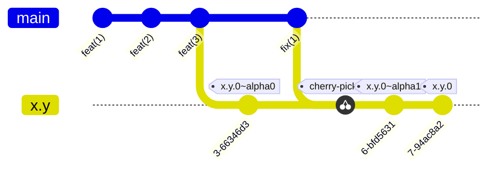
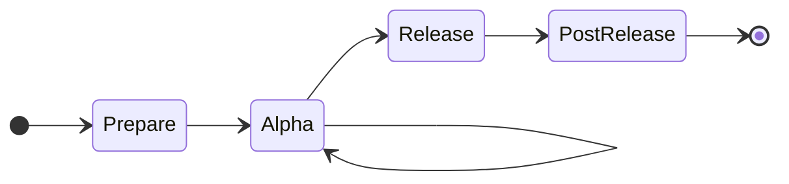
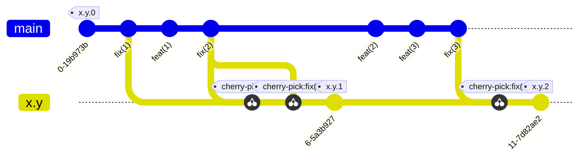
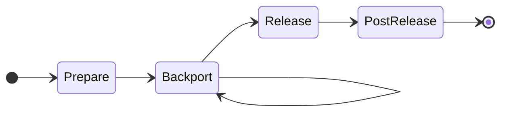

# Release Process

<!-- NB. This document used to be located on the github wiki, at
 https://github.com/ocaml/dune/wiki/Release-process -->

This document explains how we release dune. Its goal is to describe how things
are done in practice, not discuss how they should be done. There are two
aspects to this:

- a fairly rigid flowchart-style process for each type of release
- a softer "decision" section that explains what should inform the decisions to
  take when there is a manual call to make.

## Prerequisites

- The latest [dune-release](https://github.com/tarides/dune-release) installed in your dev switch
- A recent version of [github-cli](https://github.com/cli/cli) installed on your system

The mechanical steps below are automated by the scripts in this directory. See
[./README.md](./README.md) for what each one does.

## Prepare

Run

```
$ INCREMENT=(patch|minor|major) ./doc/dev/releases/release-init.sh
```

This opens the release tracking issue, creates the release candidate branch
`X.Y.Z-rc`, and opens the draft release pull request. Then work thru the
checklist on the tracking issue, including listing and updating the known
blockers that are preventing release.

## Major / Minor Releases (`x.y.0`)


```mermaid
gitGraph
  commit id: "feat(1)"
  commit id: "feat(2)"
  commit id: "feat(3)"
  branch "x.y"
  commit tag: "x.y.0~alpha0"
  checkout main
  commit id: "fix(1)"
  checkout "x.y"
  cherry-pick id: "fix(1)"
  commit tag: "x.y.0~alpha1"
  commit tag: "x.y.0"
```


```mermaid
stateDiagram-v2
    direction LR
    [*] --> Prepare
    Prepare --> Alpha
    Alpha --> Alpha
    Alpha --> Release
    Release --> PostRelease
    PostRelease --> [*]
```

### Pre-release phase

During the pre-release phase, we produce alpha releases, which we use to run the
opam-ci to check for integration with the wider ocaml ecosystem.

1. Create and checkout the release candidate branch `X.Y.Z-rc` from the head of
   `main` (done by `release-init.sh`)
2. Let `N=0`
3. Prepare alpha release
    - If `N>0`
        - Get all regressions fixed in `main`
        - Either cherry-pick the fixes from `main` into the rc branch, or create a
          new branch off `main`. (This is a judgment call, based on weighing risk of
          picking up new regressions vs. the benefits of simpler process and picking
          up additional improvements from main.)
        - Pushing to the `X.Y.Z-rc` branch runs the pre-release CI jobs
          automatically: [mirage](https://github.com/ocaml/dune/actions/workflows/mirage.yml),
          [packaging](https://github.com/ocaml/dune/actions/workflows/isolated-package-build-pre-release.yml),
          [revdep packages](https://github.com/ocaml/dune/actions/workflows/revdeps-release-coverage.yml)
          and [revdep devtools](https://github.com/ocaml/dune/actions/workflows/revdeps-release-devtools.yml).
        - If the pre-release CI detects regressions, goto (3).
    - Cut the alpha from the release candidate branch:

      ```
      $ RELEASE_KIND=prerelease ./doc/dev/releases/release-cut.sh
      ```

      The alpha number is derived from the existing tags, starting at
      `X.Y.Z~alpha0`. The script verifies that the branch is fit to release,
      prints the changelog it is about to commit for review, and then commits
      it, pushes, and publishes. Passing `DRY_RUN=true` stops short of every
      mutating step, so the same checks and the same changelog preview can be
      seen without cutting anything.

      The GitHub release is marked as a pre-release and the opam repository
      pull request is opened as a draft, both automatically.
    - Wait for the `opam-ci` results
    - Review the results:
        - Any build or test failures in dune's own packages require fixes
        - compare the new CI revdeps errors with the [errors from previous
          releases][prev-releases].
            - ignore transient errors (disk full, switch disconnected, cancelled, etc)
        - If defects are discovered:
            - File issues about all regressions, add them to known blockers
            - Mark opam alpha PR as closed
            - Let `N=N+1` and goto (3)

[prev-releases]: https://github.com/ocaml/dune/wiki/Reverse-dependencies-CI-logs

### Release phase

- Cut the release from the `X.Y.Z-rc` branch:

  ```
  $ RELEASE_KIND=release ./doc/dev/releases/release-cut.sh
  ```

  The changelog section for `X.Y.Z` is regenerated from the change fragments,
  which have been accumulating across the alphas rather than being consumed by
  them, so the entries from every alpha are combined into one section dated the
  day of the release. The fragments are consumed only now.
- Add a comment on the opam repo PR linking back to the release tracker issues
 and explaining that all triage is completed, and ask the opam repo maintainers
 to bypass the opam-ci.
- In case of regression:
    - Cancel the minor release publication by closing the opam repo PR
    - Mark the GitHub release as a pre-release
    - Proceed to a patch release

## Point Releases / Patch Releases (`X.Y.Z`, `Z >= 0`)


```mermaid
gitGraph
  commit tag: "x.y.0"
  commit id: "fix(1)"
  commit id: "feat(1)"
  commit id: "fix(2)"
  branch x.y
  cherry-pick id: "fix(1)"
  cherry-pick id: "fix(2)"
  commit tag: "x.y.1"
  checkout main
  commit id: "feat(2)"
  commit id: "feat(3)"
  commit id: "fix(3)"
  checkout x.y
  cherry-pick id: "fix(3)"
  commit tag: "x.y.2"
```


```mermaid
stateDiagram-v2
    direction LR
    [*] --> Prepare
    Prepare --> Backport
    Backport --> Backport
    Backport --> Release
    Release --> PostRelease
    PostRelease --> [*]
```

- Backport each fix from `main` with
  `VERSION=X.Y.Z PR=<pr-number> ./doc/dev/releases/backport.sh`, and merge the
  resulting pull request once its CI passes.
- Cut the release from the `X.Y.Z-rc` branch:

  ```
  $ RELEASE_KIND=release ./doc/dev/releases/release-cut.sh
  ```

- Wait for the `opam-ci` results
- Review the results:
    - Any build or test failures in dune's own packages require fixes
    - compare the new CI revdeps errors with the [errors from previous releases][prev-releases].
        - ignore transient errors (disk full, switch disconnected, cancelled, etc)
    - If defects are discovered:
        - Close the opam repo PR.
        - File issues about all regressions.
        - Mark GitHub release as a pre-release.
        - Cut a new patch release.

## Cutting a release

`release-cut.sh` refuses to cut a release unless

- the working tree is clean,
- `dune-project` declares the language version of the release series, and the
  `dune` lower bounds in `opam/*.opam` agree with it,
- the tag the release would create does not already exist, locally or on the
  remote, and
- every check run on the head of the release candidate branch has completed and
  passed. Checks that have not reported yet count as a failure, not a pass, so
  cutting immediately after a push is refused rather than waved through.

It then prints the changelog it is about to commit and asks for confirmation.
Reviewing that diff is the review of the changelog: nothing has been committed,
pushed, or published at that point.

### Resuming an interrupted release

Publication is a sequence of steps that is not transactional, so a failure part
way through leaves the earlier steps done — a failure at `opam submit` leaves a
pushed tag and a published GitHub release behind. Rerunning `release-cut.sh` in
that state is refused, because the tag now exists.

Resume from the step that failed instead, using the individual targets:

```
$ make opam-release-tag
$ make opam-release-distrib
$ make opam-release-publish
$ make opam-release-opam-pkg
$ make opam-release-opam-submit
```

Use the `opam-release-` targets rather than the `dune-release-` ones they wrap:
like `opam-release`, they run the step under the dune being released, instead of
whichever dune happens to be on `PATH`.

Pass the same `RELEASE_KIND` that the release was started with, so that an alpha
is still published as a pre-release and still submitted to opam as a draft.

## Decisions

- Release cadence:
  - we aim for a minor release roughly every 4 to 6 weeks. More than 8 tends to
    make riskier releases; less than 3 would be too much overhead.
  - we do point releases only for the latest release minor version.

- Release Go/No Go after alpha:
  - the goal is to determine, once the known blockers are fixed, if we need an
    alpha(N+1) to get enough confidence about `x.y.0`
  - downside if release is Go but a bug is found: need a quick point release.
  - downside if release is No Go but not bug is found: waste of ~1 day and
    the ~50k builds.

- Determine if a change can be backported:
  - it needs to be a fix, with no version-specific behaviour
  - it needs to be merged in `main`

- Triage:
  - The thing to determine is whether a failure is a regression: considering a
    failure, would the same build plan succeed with the previous release of Dune?
    - Ultimately it's possible to run that locally, for example with `opam
      build`.
    - Comparing to the previous release is often enough; but note that some new
      packages have been added in the meantime.
  - Transient errors can be ignored or restarted; however some of them like
    "solver timed out" can not succeed. Some packages are known to fail in
    `opam-repo-ci` but there is no good way to skip them.
  - Sending metadata fixes in `opam-repository` (e.g. OCaml 5 failures) is nice
    to do but not required.
