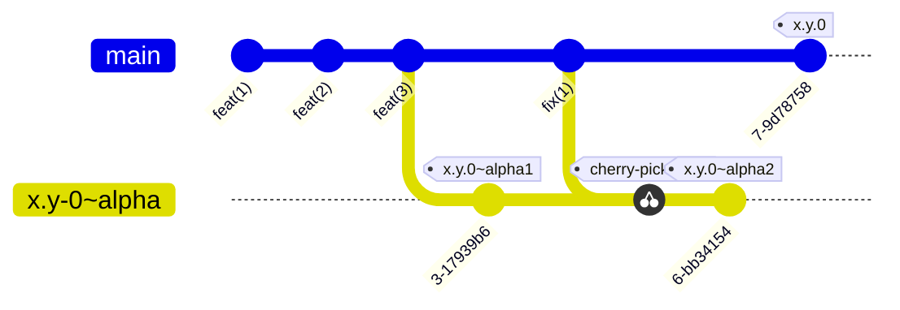
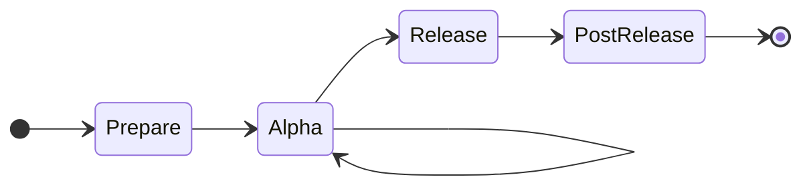
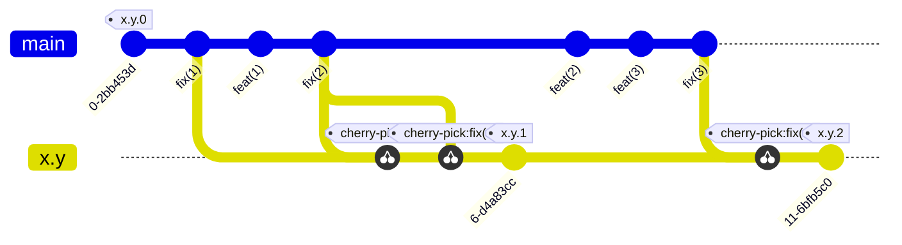
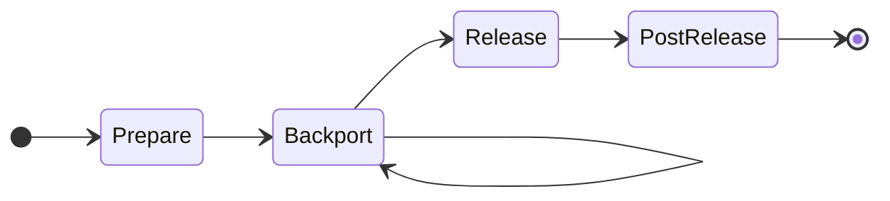

# Release Process

## Minor Releases (`x.y.0`)

- Prepare:
  - Open tracking issue with expected alpha1 date
  - List (and update) known blockers. These prevent releasing `x.y.0`
  - Add "All x.y.z changelogs merged" as blocker

- Alpha time:
  - On alpha branch, prepare alpha release:
    - (for N=0) create `x.y.0~alpha` branch
    - (for N>1) merge main into alpha branch
    - cherry-pick extra commits from `main` (if any)
    - prepare changelog (ensure version is `x.y.0~alphaN`)
    - `make opam-release`
    - mark opam-repo PR as draft
  - Wait for `opam-repo-ci`
  - Triage phase:
    - consider new failures comparing from latest "known good" release
    - ignore transient errors (disk full, switch disconnected, cancelled, etc)
    - file issues about regressions, add them to known blockers
  - Go/no go for next alpha:
    - the goal is to determine, once the known blockers are fixed, if we need
      an alpha(N+1) to get enough confidence about `x.y.0`
    - Mark alpha PR as closed

- Release time:
  - On main, prepare changelog (compile entries, set header with version)
  - Open a PR `prepare-x.y.0`
  - Self-merge
  - `make opam-release` from updated main
  - Triage
  - In case of regression:
    - mitigate (for example if this happens on a single OS, set `available`
      appropriately)
    - prepare point release
    - in the worst case, the release can be cancelled completely and only come
      in a point release.

- Post-release:
  - Categorize changelog entries into Added / Fixed / Changed / Removed / Deprecated
  - Open PR on `ocaml/ocaml.org` to add a file in under `data/changelog/dune`
  - Post to discuss
  - Close release milestone
  - Close tracking issue

## Point Releases / Patch Releases (`x.y.z`, `z >= 0`)

- Prepare
  - Create release tracking issue
  - List fixes present in main to backport
  - Blockers for this release include:
    - all backports of listed fixes
    - changelogs of previous point releases are merged

- Backport
  - Branch setup
    - (z=1) Create branch `x.y` from commit tagged `x.y.0`
    - (z>1) Position on branch `x.y`
  - `git cherry-pick` commits as merged in `main`
  - Open PR
    - Set `x.y` as target branch, e.g. `gh pr create -B x.y`
    - Title starts with `[x.y]`
    - List PR in blockers

- Release
  - Position on `x.y`
  - Prepare changelog
  - Open a PR `prepare-x.y.z`
  - `make opam-release`
  - Triage

- Post-release
  - Open PR on `ocaml/ocaml.org` to add a file in under `data/changelog/dune`
  - Post changelog on Discuss in the same thread as `x.y.0`
  - Merge changelog
  - Close release tracking issue

## Decisions

- Release Go/No Go after alpha:
  - downside if release is GO but a bug is found: need a quick point release.
  - downside if release is NO GO but not bug is found: waste of ~1 day and
    the ~50k builds.

- Determine if a change can be backported:
  - it needs to be a fix, with no version-specific behaviour
  - it needs to be merged in `main`
