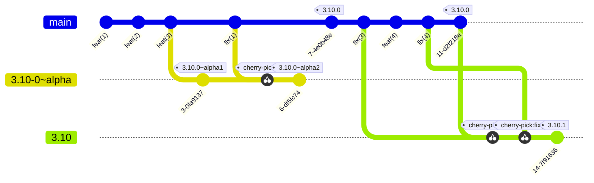

# Release process

```mermaid
gitGraph
  commit id: "feat(1)"
  commit id: "feat(2)"
  commit id: "feat(3)"
  branch "3.10-0~alpha"
  commit tag: "3.10.0~alpha1"
  checkout main
  commit id: "fix(1)"
  checkout "3.10-0~alpha"
  cherry-pick id: "fix(1)"
  commit tag: "3.10.0~alpha2"
  checkout main
  commit tag: "3.10.0"
  commit id: "fix(3)"
  commit id: "feat(4)"
  commit id: "fix(4)"
  commit tag: "3.10.0"
  branch 3.10
  cherry-pick id: "fix(3)"
  cherry-pick id: "fix(4)"
  commit tag: "3.10.1"
  checkout main
```
